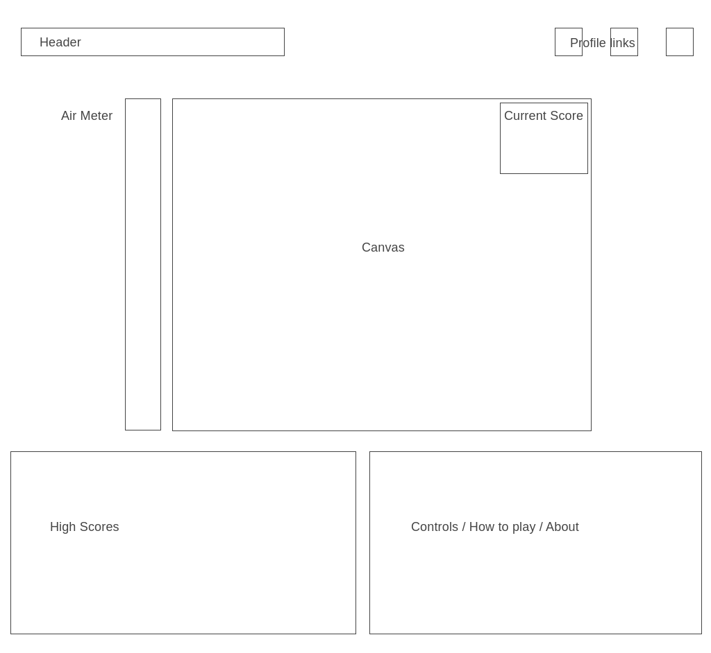

# ScuubaDuu

## Overview
  - Scuuba Duu is a game of underwater endurance. Divers have a limited supply of oygen in their tanks, and their levels decrease as they dive. The diver must collect oxygen from rising bubbles to continue their dive. Points are awarded for duration of play, and mayber extra sand dollars or oyster pearls collected. If a diver runs out of oxygen or hits a shark, the game is over. 

## MVPs
  - Users can initialize a game. 
  - Users can control divers with arrow keys. 
  - Users can collect bubbles to increase air gauge. 
  - Users can receive points during their dives. 
  - Users can log their high score when the game is over. 
## Wireframe
 
## Architecture and Technology
  - Javascript for game logic
  - HTML5 Canvas for rendering game
  - Firebase DB for persisting high scores
  - Webpack for bundling files
## Implementation Timeline
  - Set up basic skeleton (4.26.20, Sunday)
  - Draw basic canvas shapes for each component, work on rendering intervals for randomized bubbles / sand dollars / sharks (4.27.20, Monday)
  - Begin core game logic -- Starting game, oxygen meter levels, point accruing & game over.  (4.28.20, Tuesday)
  - Continue game logic and rendering details. (4.29.20, Wednesday)
  - Set up database for persisting highscores. Add portfolio links, & how to play/commands. (4.30.20, Thursday)
  - Production README, addtl styling (5.1.20, Friday)
## Bonus Features
  - Points for dive style (addtl controls, think ski free)
